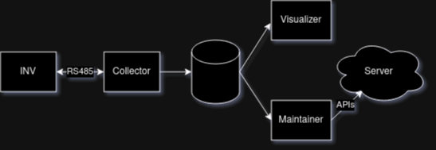

# ts
time seires

# todo
1. Read documents (fault) ☑
2. Write script read all params ☑
3. Build collector & database □
4. Notebooks (threshold, stastictic, ML) □
5. Build visualizer □
6. Build maintainer □

# data
- stopped: data/data1.csv
- xxHz: data/data2.csv (normal speed)
- yyHz: data/data3.csv (high speed)
- zzHz: data/data3.csv (low speed)

# references

https://inloop.github.io/sqlite-viewer/

https://csv-viewer-online.github.io/

[ SQLite Database with Python: How to Create Tables, Insert Data, and Run Queries ](https://www.youtube.com/watch?v=ZQAnkjfvZAw)

[ Anomaly detection in time series with Python | Data Science with Marco ](https://www.youtube.com/watch?v=qy41dXGbAxY)

[Anomaly detection in multivariate time series ](https://www.kaggle.com/code/drscarlat/anomaly-detection-in-multivariate-time-series)

[pymodbus](https://pymodbus.readthedocs.io/en/latest/source/readme.html)

[007 | Read & Write Holding Register of Modbus RTU or Serial Device Using Python | Pymodbus |](https://www.youtube.com/watch?v=pLecgMoB-dA)

[Modpoll Modbus Master Simulator ](https://www.modbusdriver.com/modpoll.html)

[ Siemens Sinamics V20 inverter with MODBUS communication for IoT without PLC. ](https://www.youtube.com/watch?v=pRJo0vXLvzU)
